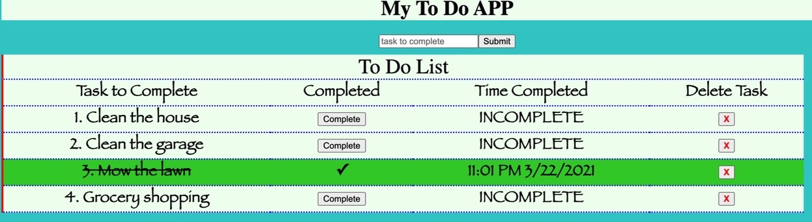

To Do APP
==

Technologies Used
-

- JAVASCRIPT
- JQUERY
- NODE
- Express
- SQL

Specific Requirements to meet
-

* Create a front end experience that allows a user to create a task.
* When the Task is created, it should be stored inside of a database (SQL)
* Whenever a Task is created the front end should refresh to show all tasks that need to be completed.
* Each Task should have an option to 'Complete' or 'Delete'.
* When a Task is complete, its visual representation should change on the front end. For example, the background of the task container could change from gray to green. The complete option should be  'checked off'. Each of these are accomplished in CSS, but will need to hook into logic to know whether or not the task is complete.
* Whether or not a Task is complete should also be stored in the database.
* Deleting a Task should remove it both from the front end as well as the Database.

The process:
---

- [x] set up files, folders, server, database
- [x] create a pool to connect to database
- [x] create a router
- [x] create a task input and submit button in html
- [x] create a clickhandler for submitting task
- [x] creat a function to add new task
- [x] create a POST route client & router
- [x] call a GET route in client & router
- [x] display get route in the DOM
- [x] create clickhandler for delete function
- [x] create delete function
- [x] create DELETE route client & router
- [x] create clickhandler for complete function
- [x] create PUT route client & router to update
- [x] add styling 
- [x] create a time stamp in complete function
- [x] add another column to the table to capture time a task is completed
- [x] append time stamp to the DOM
- [x] add an alert when deleting a task

Additional README details can be found [here](https://github.com/PrimeAcademy/readme-template/blob/master/README.md).
